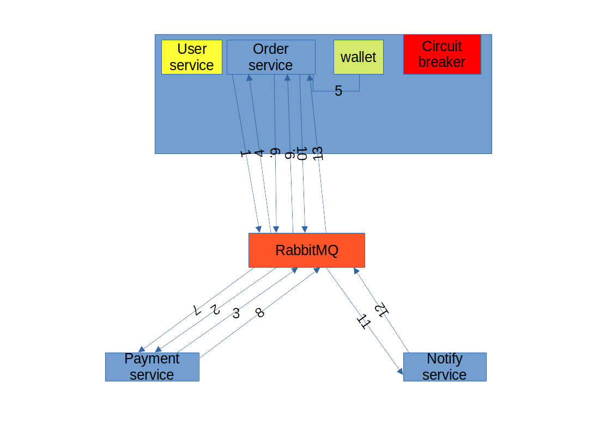

## Описание работы 
# в скобках указано текущее положение для простоты
В проекте добавлены 3 приложения:
  1. order - управляет заказкми, организует сагу (лучше выделить отдельный сервис), управляет circuit breaker (обычно его используют отдельно, а лучше в виде прокси), запрашивает кошелек пользователя (логично использовать отдельно)
  2. Payment - управляет платежом
  3. Notify - управляет оповещением

# Схема

1. Инициализация заказа
2. Получение заказа Payment service, создание payment
3. Отправка информации в Order service о payment
4. Получение информации в Order service о payment
5. Запрос в кошельке достаточной суммы
6. Отправка информации о достаточности суммы в Payment service
7. Выполнение оплаты
8. Отправка информации о платеже в Order service
9. Сохранение информации о платеже в Order service
10. Отправка информации о состоянии платежа в Notify service
11. Отправка Email
12. Отправка информация об отправке в Order service
13. Завершение саги

# на каждом этапе предусмотрены компенсирующие транзакции

# Описание работы circuit breaker, для работы с очередью слушает отдельную очередь, в которую падают просроченные сообщения.

  1. В нормальном состоянии (IsClose) сообщения свободно отправляются в брокер
  2. При получении просроченных сообщений переходит в состояние Half-Open, для задержек перед отправкой
  3. После нескольких циклов поступающих ошибок в состоянии Half-Open переходит в состояние IsOpen. Перестает принимать сообщения и возвращает ошибку до следующего цикла запуска
  4. Если ощибок нет в состояниях IsOpen и Half-Open, переходит с каждым циклом в предыдущее состояние IsOpen -> Half-Open -> IsClose.
